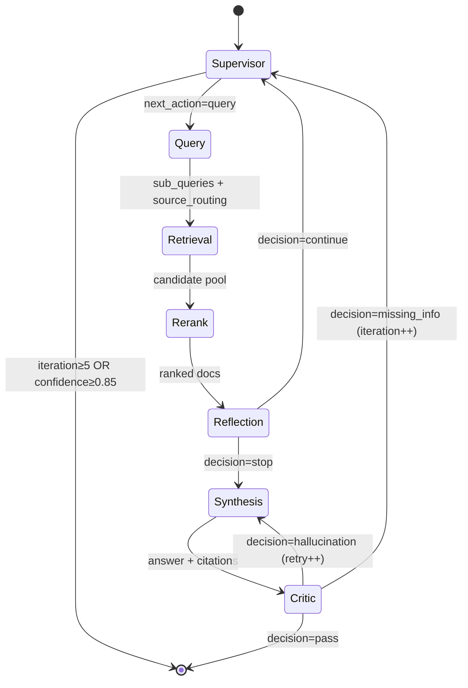
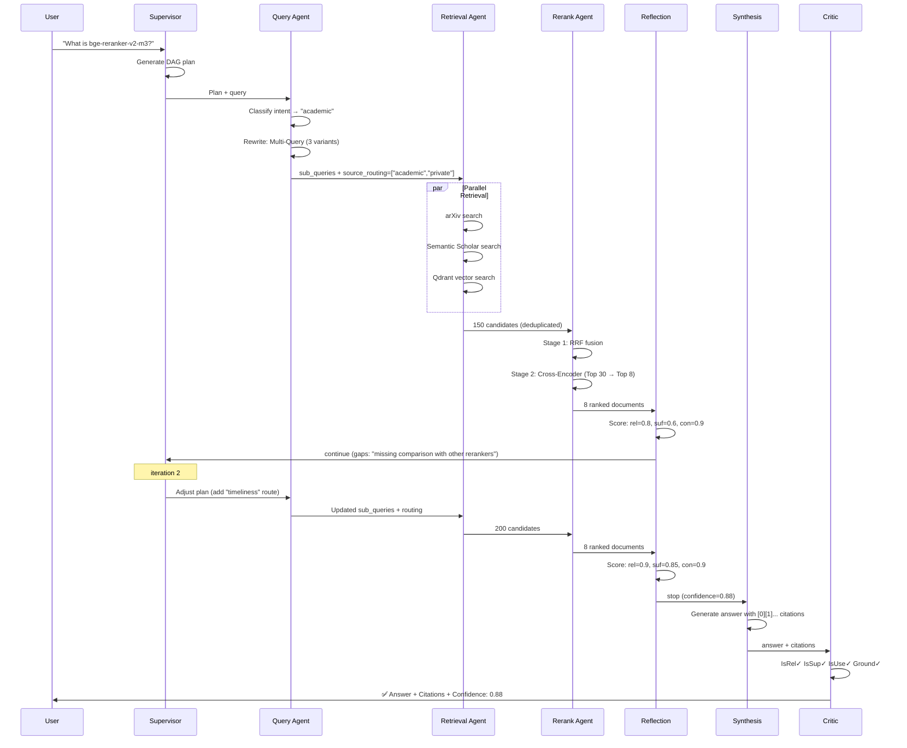

# Architecture Deep-Dive

## State Machine

The system is implemented as a LangGraph `StateGraph` with conditional edges forming a self-correcting loop:



### Termination Guardrails

| Condition | Action |
|-----------|--------|
| `iteration ≥ 5` | Force END with best-effort answer |
| `confidence ≥ 0.85` | Supervisor decides END |
| `retry_count ≥ 2` (Synthesis) | Force END after Critic |
| Reflection `confidence ≥ 0.7` | Proceed to Synthesis |

---

## SearchState

```python
class SearchState(TypedDict, total=False):
    query: str                    # Original user query
    thread_id: str                # Session ID for checkpointer
    iteration: int                # Current iteration (0-based)
    retry_count: int              # Synthesis rewrite count

    plan: Optional[dict]          # Supervisor DAG plan
    intent: Optional[str]         # timeliness|realtime|academic|code|feedback|general
    sub_queries: list[str]        # Rewritten queries
    source_routing: list[str]     # Which retrieval routes to use

    candidates: list[CandidateDoc]   # 100-300 docs after retrieval
    ranked_docs: list[CandidateDoc]  # Top K=8 after reranking

    reflection_scores: Optional[ReflectionScores]  # {relevance, sufficiency, consistency}
    gaps: list[str]               # Missing information
    decision: str                 # "continue" | "stop"

    answer: Optional[str]         # Final answer with [source_id] citations
    citations: list[Citation]     # Verified citation list
    confidence: float             # 0.0-1.0

    critic_result: Optional[CriticResult]  # {isRel, isSup, isUse, ground}
    critic_decision: str          # "pass" | "hallucination" | "missing_info"
```

---

## Agent Details

### ① Supervisor / Planner (Doubao Pro)

**Responsibilities:**
- First entry: Analyze query, generate DAG search plan
- Re-entry: Adjust plan based on Reflection/Critic feedback
- Termination: `iteration ≥ 5` or `confidence ≥ 0.85`

**Output:** `plan` dict with description, steps, and focus areas.

### ② Query Agent (Doubao Lite)

**Intent Classification:**

| Intent | Routing |
|--------|---------|
| timeliness | Tavily, Bocha, Fallback |
| realtime | Structured API, Tavily |
| academic | arXiv, Semantic Scholar, Private |
| code | GitHub, StackOverflow, Academic |
| feedback | Reddit, Xiaohongshu, App Store |
| general | Tavily, Academic, Fallback |

**Query Rewrite Strategies:**

| Strategy | When to Use | Description |
|----------|------------|-------------|
| Multi-Query | Default | Generate 3-5 query variants for RAG Fusion |
| HyDE | Document retrieval | Generate hypothetical document, then search |
| Step-Back | Detail questions | Abstract the question first |
| Decomposition | Compound questions | Break into sub-questions |

### ③ Retrieval Agent

7 retrieval routes execute in **parallel** via `asyncio.gather()`. Each route may contain multiple retrievers.

**Deduplication:** URL-level + doc_id dedup before passing to Rerank.

### ④ Rerank Agent (Two-Stage)

#### Stage 1: Reciprocal Rank Fusion (RRF)

Algorithmic fusion across heterogeneous sources — no LLM cost.

```
score(d) = Σ  1 / (k + rank_i(d))
```

Where `k = 60` (default), `rank_i(d)` is the rank of document `d` in source `i`.

**Why RRF?** Different retrievers produce incompatible scores (BM25 vs cosine similarity vs API score). RRF normalizes by rank position only.

#### Stage 2: Cross-Encoder Reranking

Top-30 from RRF are scored by `bge-reranker-v2-m3` via remote API:

```
score_i = CrossEncoder(query, doc_i)  →  relevance_score
```

**Output:** Top K=8 documents with normalized scores.

### ⑤ Reflection Agent (Doubao Lite)

Three-dimensional assessment:

| Dimension | Question | Score Range |
|-----------|----------|-------------|
| Relevance | Are the evidence documents related to the query? | 0-1 |
| Sufficiency | Is there enough information to answer the query? | 0-1 |
| Consistency | Are the evidence documents consistent with each other? | 0-1 |

**Decision logic:**
- `confidence = (relevance + sufficiency + consistency) / 3`
- `confidence ≥ 0.7` → stop (proceed to Synthesis)
- `confidence < 0.7` → continue (loop back to Supervisor with identified gaps)

### ⑥ Synthesis Agent (Doubao Pro)

**Rules:**
1. Every claim must include `[source_id]` citation
2. Conflict resolution: Official > Authority Media > Community; Newer > Older
3. Never cite URLs not present in the evidence
4. If evidence is insufficient, explicitly state limitations

### ⑦ Critic Agent (Self-RAG, Doubao Lite)

Four-dimensional verification:

| Check | Question | Failure Action |
|-------|----------|---------------|
| IsRel | Is each citation relevant to the query? | → Supervisor (missing_info) |
| IsSup | Can each statement be derived from citations? (hallucination check) | → Synthesis (rewrite) |
| IsUse | Does the overall answer address the query? | → Supervisor (missing_info) |
| Ground | Do cited source_ids actually exist in evidence? | → Synthesis (rewrite) |

---

## Sequence Diagram: Full Search Flow



---

## Extending the System

### Adding a New Retriever

1. Create `src/agentic_search/retrieval/my_retriever.py`:

```python
from agentic_search.retrieval.base import BaseRetriever
from agentic_search.state import CandidateDoc

class MyRetriever(BaseRetriever):
    source_type = "my_source"

    async def retrieve(self, query, max_results=10, **kwargs) -> list[CandidateDoc]:
        # Your implementation
        return [self._make_doc(...)]
```

2. Register in `src/agentic_search/retrieval/__init__.py`:

```python
_RETRIEVER_CLASSES["my_route"] = ["MyRetriever"]
_MODULE_MAP["MyRetriever"] = "agentic_search.retrieval.my_retriever"
```

3. Add to intent routing in `nodes/query.py` if needed.

### Adding a New Agent Node

1. Create `src/agentic_search/nodes/my_node.py` with an async function:

```python
async def my_node(state: SearchState) -> dict:
    # Process state, return partial updates
    return {"key": "value"}
```

2. Register in `graph.py`:

```python
graph.add_node("my_node", my_node)
graph.add_edge("previous_node", "my_node")
```

### Changing the LLM Provider

Edit `src/agentic_search/llm/doubao.py` — swap `ChatOpenAI` with any LangChain-compatible chat model (e.g., `ChatAnthropic`, `ChatGoogleGenerativeAI`).
