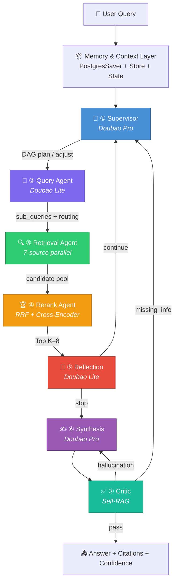

# 🔍 Agentic Search

A production-grade **multi-agent search system** built with [LangGraph](https://github.com/langchain-ai/langgraph), featuring 7 specialized agents, 7 retrieval sources, two-stage reranking, and Self-RAG quality assurance.

> **TL;DR** — User query → Supervisor plans → Query rewrites → 7-source parallel retrieval → RRF + Cross-Encoder rerank → Reflection → Synthesis with citations → Self-RAG critic → Answer with confidence score.

[](https://www.python.org/downloads/)
[](https://github.com/langchain-ai/langgraph)
[](https://fastapi.tiangolo.com/)
[](LICENSE)

---

## 🏗️ Architecture



### 7 Retrieval Sources

| Route | Sources | Use Case |
|-------|---------|----------|
| ⏰ Timeliness | Tavily, Bocha | News, current events |
| ⚡ Realtime | Structured APIs | Stock, weather, exchange rates |
| 📚 Academic | arXiv, Semantic Scholar | Research papers |
| 💻 Code | GitHub, StackOverflow | Code & API docs |
| 📣 Feedback | Reddit, Xiaohongshu, App Store | Product reviews |
| 🔒 Private | Qdrant (bge-m3), Feishu Wiki, BM25 | Internal knowledge |
| 🌐 Fallback | Browser Agent | Last-resort web search |

---

## ⚡ Quick Start

### 1. Install

```bash
git clone https://github.com/YOUR_USERNAME/agentic_search.git
cd agentic_search
python3 -m venv .venv && source .venv/bin/activate
pip install -e ".[dev]"
```

### 2. Configure

```bash
cp .env.example .env
# Edit .env with your API keys (at minimum ARK_API_KEY for Doubao LLM)
```

### 3. Run Demo (no API keys needed)

```bash
python examples/demo_mock.py
```

### 4. Start API Server

```bash
agentic-search serve
# or: uvicorn agentic_search.api.server:create_app --factory --reload
```

### 5. Search

```bash
# REST API
curl -X POST http://localhost:8000/search \
  -H "Content-Type: application/json" \
  -d '{"query": "What are the latest advances in RAG systems?"}'

# SSE Stream
curl -N -X POST http://localhost:8000/search/stream \
  -H "Content-Type: application/json" \
  -d '{"query": "LangGraph vs CrewAI comparison"}'

# CLI
agentic-search search "What is bge-reranker-v2-m3?"
```

---

## 🧩 Tech Stack

| Layer | Technology |
|-------|-----------|
| Orchestration | LangGraph 1.1 (StateGraph + conditional edges) |
| LLM (Pro) | Doubao Pro via OpenAI-compatible API |
| LLM (Lite) | Doubao Lite via OpenAI-compatible API |
| Checkpointer | PostgreSQL (AsyncPostgresSaver) |
| Vector Store | Qdrant + bge-m3 embeddings |
| Reranker | bge-reranker-v2-m3 (remote API) |
| Web Search | Tavily, Bocha |
| Academic | arXiv API, Semantic Scholar API |
| API | FastAPI + SSE streaming |
| Package | Python 3.11+, pyproject.toml |

---

## 📁 Project Structure

```
agentic_search/
├── src/agentic_search/
│   ├── graph.py                 # LangGraph StateGraph + conditional edges
│   ├── state.py                 # SearchState TypedDict
│   ├── config.py                # pydantic-settings
│   ├── nodes/                   # 7 Agent nodes
│   │   ├── supervisor.py        # ① Planner (Doubao Pro)
│   │   ├── query.py             # ② Intent + Rewrite (Doubao Lite)
│   │   ├── retrieval.py         # ③ Parallel dispatch
│   │   ├── rerank.py            # ④ RRF + Cross-Encoder
│   │   ├── reflection.py        # ⑤ Quality assessment
│   │   ├── synthesis.py         # ⑥ Answer generation (Doubao Pro)
│   │   └── critic.py            # ⑦ Self-RAG verification
│   ├── retrieval/               # 7 retrieval sources
│   │   ├── base.py              # BaseRetriever ABC
│   │   ├── tavily_retriever.py  # Tavily + Bocha
│   │   ├── structured_api.py    # Stock/Weather/Exchange
│   │   ├── arxiv_retriever.py   # arXiv + Semantic Scholar
│   │   ├── code_retriever.py    # GitHub + StackOverflow
│   │   ├── feedback_retriever.py# Reddit + Xiaohongshu + App Store
│   │   ├── private_retriever.py # Qdrant + Feishu Wiki + BM25
│   │   └── browser_retriever.py # Browser Agent fallback
│   ├── rerank/                  # Two-stage reranking
│   │   ├── rrf.py               # Stage 1: Reciprocal Rank Fusion
│   │   └── cross_encoder.py     # Stage 2: Cross-Encoder API
│   ├── llm/
│   │   └── doubao.py            # Doubao Pro/Lite factory
│   └── api/
│       └── server.py            # FastAPI + SSE
├── examples/
│   ├── demo_mock.py             # Mock demo (no API keys)
│   └── demo_cli.py              # Interactive CLI
├── tests/
├── Dockerfile
├── docker-compose.yml
└── pyproject.toml
```

---

## 🔑 Key Design Decisions

1. **Supervisor → Reflection → Critic loop**: Unlike linear RAG pipelines, this system self-corrects. If Reflection finds insufficient evidence, it loops back to Supervisor for additional retrieval. If Critic detects hallucination, it loops back to Synthesis for rewriting.

2. **Two-stage reranking**: RRF (algorithmic, no LLM cost) unifies heterogeneous sources, then Cross-Encoder (bge-reranker-v2-m3) does semantic precision ranking on Top-30.

3. **Lazy-loaded retrievers**: Retriever instances are created on-demand to avoid import-time API key validation errors.

4. **Forced termination guardrails**: `iteration ≥ 5` or `retry_count ≥ 2` forces END with best-effort answer + low confidence flag.

---

## 📖 Documentation

- [ARCHITECTURE.md](ARCHITECTURE.md) — Technical deep-dive (state machine, algorithms, sequence diagrams)
- [API Reference](#) — FastAPI auto-docs at `/docs` when server is running

---

## 🧪 Testing

```bash
pytest tests/ -v
```

---

## 🐳 Docker

```bash
docker-compose up -d
# Starts: API server + PostgreSQL + Qdrant
```

---

## 📄 License

[MIT](LICENSE)
